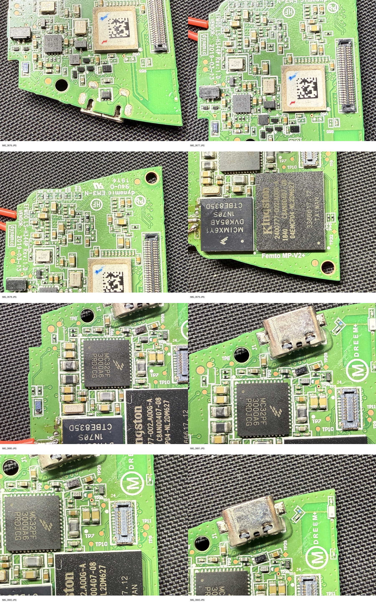

# Dreem 2 raw-data and root-recovery research

**Disclaimer:** All documentation was written by Codex GPT-5.6-Sol and AI was used extensively, though not exclusively, throughout this project.

This repository documents an effort to recover filesystem access or a full-fidelity overnight recording from a Dreem 2 EEG headband. It brings together maintained recovery tools, hardware notes, protocol research, prepared i.MX6ULL payloads, evidence summaries, and observations from approaches that did not work under the conditions tested.

> **Current result:** root/filesystem access has not been obtained, and a genuine overnight Dreem `.h5` recording has not been recovered. The BLE, companion-app, and backend paths tested so far returned compact `reporting_v2.data` payloads rather than identifiable raw EEG.

These are bounded experimental results, not proof that every path has been discovered or exhausted. Different hardware revisions, firmware, account states, timing, tools, or interpretations may lead to different outcomes.

The work is scoped to an owner-operated device and local research environment. This is a technical research archive, not a turnkey rooting tool or a supported consumer application.

[](hardware/README.md)

## Why this exists

Dreem 2 appears to record and process sleep data on an embedded Linux system rather than acting like a simple live-streaming BLE sensor. The recovery target is therefore one of the following:

- authenticated root or filesystem access to the owner's headset;
- a verified raw overnight HDF5 recording from its internal storage; or
- a read-only storage image from which HDF5 content can be identified and recovered.

Compact companion-app reports, hypnograms, and low-rate preview data are useful for understanding the protocol, but they are not substitutes for the native raw recording.

A recovered raw file would enable independent EEG inspection, sleep-stage validation, and downstream session/epoch/hypnogram pipelines. Those uses remain out of scope until the source recording is actually recovered and its schema is verified.

## Status at a glance

| Area | Result | Practical implication |
| --- | --- | --- |
| Root/filesystem access | Not obtained | No direct access to internal recordings yet |
| Raw overnight HDF5 | Not recovered | The primary research objective remains open |
| BLE/app reports | Recovered | They contain compact `reporting_v2.data`, not raw EEG |
| Bluetooth Classic reports | Recovered | They expose the same compact report surface |
| Backend report routes | Tested | No hidden raw object was found in the tested account state |
| LAN SSH | Service observed, no authentication | Credential guessing and broad enumeration are stopped |
| Physical SDP entry | Not reliably achieved | A human-applied TP10-to-GND boot condition is one promising next path |
| U-Boot/UMS payloads | Prepared, not proven on-device | Available for a future controlled SDP recovery window |
| HDF5 carving | Tooling prepared | Ready for a read-only storage image if one becomes available |

The concise evidence behind these statements is in the [evidence summary](docs/evidence-summary.md). A detailed technical narrative, constraints, attempt history, and candidate next action are in the [Dreem 2 recovery reference](docs/dreem-2-recovery-reference.md).

## Start here

| If you want to... | Read this |
| --- | --- |
| Understand the outcome in a few minutes | [Evidence summary](docs/evidence-summary.md) |
| Review the detailed investigation history | [Dreem 2 recovery reference](docs/dreem-2-recovery-reference.md) |
| Plan another physical recovery attempt | [Documented physical next action and hard constraints](docs/dreem-2-recovery-reference.md#current-best-next-action) |
| Find a reusable recovery or protocol utility | [Maintained tools](tools/README.md) |
| Inspect prepared UUU, U-Boot, OCRAM, or OpenOCD assets | [Hardware recovery assets](recovery/README.md) |
| Identify board areas and test points | [Hardware images](hardware/README.md) |
| Understand the Android helper projects | [Helper applications](apps/README.md) |
| Review one-off backend and security probes | [Experiments](experiments/README.md) |
| Check external research and upstream projects | [Public references](docs/references.md) |
| Consult the original device documentation | [Dreem 2 user manual](docs/dreem-2-user-manual.pdf) |

## Findings so far

### Tested report paths returned processed data

In the configurations examined, BLE report characteristics, Bluetooth Classic report IDs, companion-app storage, and tested backend routes returned the same small report format. Retrieved archives contained `reporting_v2.data`; no HDF5 structure or full-fidelity EEG channels were identified in those samples.

Repeating those exact report-download experiments under the same conditions may have limited value, but different firmware, account state, commands, timing, or newly discovered protocol behavior could produce different results. The relevant observations are summarized under [BLE report path](docs/evidence-summary.md#ble-report-path) and [backend/report/dataupload](docs/evidence-summary.md#backend--report--dataupload).

### A promising route: physical recovery

Based on the evidence gathered so far, a comparatively promising next experiment is to force the i.MX6ULL into Serial Downloader Protocol using the suspected physical boot condition, then proceed conservatively:

```text
TP10-to-GND during attach/power-up
              |
              v
      i.MX6ULL SDP enumeration
              |
              v
       non-persistent triage
              |
              v
      accepted U-Boot UMS image
              |
              v
       read-only storage image
              |
              v
       HDF5 signature carving
```

The orchestration and recovery components for that path are:

1. [`dreem_physical_sdp_window.py`](tools/dreem_physical_sdp_window.py) for a controlled, operator-assisted SDP window.
2. [`dreem_sdp_recovery_watch.py`](tools/dreem_sdp_recovery_watch.py) to detect the expected recovery USB device.
3. [`dreem_sdp_triage.py`](tools/dreem_sdp_triage.py) and the [`imx-usb` configurations](recovery/imx-usb/) for non-persistent inspection.
4. The prepared [`U-Boot UMS assets`](recovery/u-boot/ums-boot-assets/) for storage exposure experiments.
5. [`dreem_ums_dump_watch.py`](tools/dreem_ums_dump_watch.py) to detect and optionally image a newly exposed mass-storage device.
6. [`dreem_h5_carve.py`](tools/dreem_h5_carve.py) to scan an image for HDF5 signatures and validate candidates with `h5ls`.

Read the [physical SDP/UMS evidence](docs/evidence-summary.md#physical-sdp--ums) and the full [hard constraints](docs/dreem-2-recovery-reference.md#hard-constraints) before connecting or powering hardware.

## Repository map

| Path | Contents |
| --- | --- |
| [`docs/`](docs/) | Consolidated recovery narrative, evidence summary, references, device manual, and community draft |
| [`tools/`](tools/README.md) | Maintained SDP, UMS, HDF5, Bluetooth Classic, and ATT utilities |
| [`tests/`](tests/) | Unit tests for the maintained Python recovery utilities |
| [`recovery/`](recovery/README.md) | i.MX6ULL configs, OCRAM probes, UUU scripts, OpenOCD config, and U-Boot UMS assets |
| [`apps/`](apps/README.md) | Independent Android helpers and the privileged BLE-helper Magisk module |
| [`experiments/`](experiments/README.md) | One-off backend, authentication, capture, and historical security probes |
| [`hardware/`](hardware/README.md) | Mainboard photographs, component/test-point closeups, and the FCC construction-photo exhibit |
| [`third-party/`](third-party/README.md) | Small, attributed snapshots of directly relevant upstream projects |

## Maintained tooling

The root README provides orientation; [`tools/README.md`](tools/README.md) is the maintained tool index.

### SDP, storage, and HDF5

| Tool | Purpose |
| --- | --- |
| [`dreem_physical_sdp_window.py`](tools/dreem_physical_sdp_window.py) | Coordinates a human-assisted boot window, optional triage, U-Boot attempts, and UMS watching |
| [`dreem_sdp_recovery_watch.py`](tools/dreem_sdp_recovery_watch.py) | Watches for the i.MX6ULL SDP USB identifier |
| [`dreem_sdp_triage.py`](tools/dreem_sdp_triage.py) | Runs a bounded set of non-persistent SDP probes |
| [`dreem_sdp_checkdata.py`](tools/dreem_sdp_checkdata.py) | Builds and runs SDP check-data experiments |
| [`dreem_ums_dump_watch.py`](tools/dreem_ums_dump_watch.py) | Watches for newly attached mass storage and supports read-only imaging |
| [`dreem_h5_carve.py`](tools/dreem_h5_carve.py) | Finds HDF5 signatures in images and validates candidate offsets |

### Bluetooth and ATT

| Tool | Purpose |
| --- | --- |
| [`dreem_btclassic_report_fetch.py`](tools/dreem_btclassic_report_fetch.py) | Probes known Bluetooth Classic report IDs |
| [`dreem_btclassic_request.py`](tools/dreem_btclassic_request.py) | Sends a single Bluetooth Classic request for controlled protocol testing |
| [`dreem_btclassic_wifi_auth.py`](tools/dreem_btclassic_wifi_auth.py) | Builds and sends the Bluetooth Classic Wi-Fi authentication payload |
| [`dreem_att_client.c`](tools/dreem_att_client.c) | Minimal raw ATT client experiment for known-handle access |
| [`native/dreem_att_read`](tools/native/dreem_att_read/) | C source for the native ATT read helper |

Bluetooth helpers require an explicit device address. Pass the address for your own headset with `--address`, and provide Wi-Fi credentials through runtime arguments or ignored configuration files.

## Recovery assets

The [`recovery/` tree](recovery/README.md) contains experimental payloads and configurations rather than general-purpose software:

- [`imx-usb/`](recovery/imx-usb/) — register, fuse, USDHC state, and OCRAM test configurations;
- [`ocram/marker-write-smoke-test/`](recovery/ocram/marker-write-smoke-test/) — a minimal OCRAM marker-write image;
- [`ocram/uuu-probes/`](recovery/ocram/uuu-probes/) — OCRAM and SoC-register UUU probes;
- [`openocd/`](recovery/openocd/) — JTAG/OpenOCD configuration;
- [`u-boot/ums-boot-assets/`](recovery/u-boot/ums-boot-assets/) — UUU launch scripts and matching UMS boot images;
- [`u-boot/build-configs/`](recovery/u-boot/build-configs/) — retained U-Boot build configurations; and
- [`uuu/ocotp-register-read-probe/`](recovery/uuu/ocotp-register-read-probe/) — standalone OCOTP register-read experiment.

These assets can alter device state or fail because of silicon, DRAM, boot-security, or board-layout differences. Inspect every command and configuration before use.

## Helper applications and experiments

The [`apps/android/`](apps/android/) directory contains independent Android projects for BLE/GATT access, authentication experiments, and privileged Bluetooth pairing. They are separate projects rather than one shared Gradle build. The [`apps/magisk-modules/`](apps/magisk-modules/) directory contains the privileged-system-app overlay for the BLE helper. See the [application inventory](apps/README.md) before building or installing anything.

The [`experiments/`](experiments/README.md) directory preserves one-off backend and security research. These files are less stable than the maintained utilities and are retained to explain prior work, not to recommend that every experiment be repeated. In particular, SSH password guessing and broad user enumeration are stopped research paths.

## Running the tests

The maintained Python tools can be tested from the repository root:

```bash
python -m unittest discover -s tests
```

The unit suite covers the SDP watcher and triage logic, check-data probes, operator-assisted physical runner, UMS detection/imaging safeguards, and HDF5 carving behavior.

The HDF5 integration tests are skipped when either of these optional inputs is unavailable:

- the upstream fixture referenced by [`test_dreem_h5_carve.py`](tests/test_dreem_h5_carve.py); or
- the external `h5ls` command.

Most recovery tools use the Python standard library. The Bluetooth Classic helpers additionally import PyCryptodome, while hardware workflows may require platform-specific utilities such as NXP UUU, `imx_usb_loader`, `h5ls`, Android platform tools, or a working Linux Bluetooth stack. Install only the dependencies required for the path you are using, and check a tool's options before attaching hardware:

```bash
python tools/dreem_sdp_recovery_watch.py --help
python tools/dreem_h5_carve.py --help
```

## Documentation map

- [Dreem 2 recovery reference](docs/dreem-2-recovery-reference.md) — detailed record of device facts, attempts, constraints, hypotheses, and candidate next steps.
- [Evidence summary](docs/evidence-summary.md) — concise conclusions, reusable assets, and replay guidance.
- [Public references](docs/references.md) — hardware, academic, community, boot-tool, and Dreem prior art.
- [Dreem 2 user manual](docs/dreem-2-user-manual.pdf) — original device documentation retained for reference.

## Licensing and attribution

Project-authored software and text are licensed under [Apache-2.0](LICENSE). Original board photographs are licensed under [CC BY 4.0](LICENSES/CC-BY-4.0.txt). Attribution and scope are defined in [`NOTICE`](NOTICE).

U-Boot-derived recovery files, upstream source snapshots, the Dreem manual, and the FCC exhibit retain separate provenance and are not covered by the project-authored-material grants. See [Third-party notices](THIRD_PARTY_NOTICES.md) before redistributing them.

## Bottom line

Across the device, firmware, account, and network states tested so far, the software-visible report paths yielded compact processed reports rather than identifiable raw EEG. That narrows the current evidence, but it does not establish that every software path has been found or that unexplored variations cannot work. Physical SDP and storage access appear worth pursuing, while new app behavior, backend state, firmware analysis, protocol discoveries, or community evidence could reopen software approaches. This repository is intended to help the next investigator test those assumptions rather than treat them as settled.
